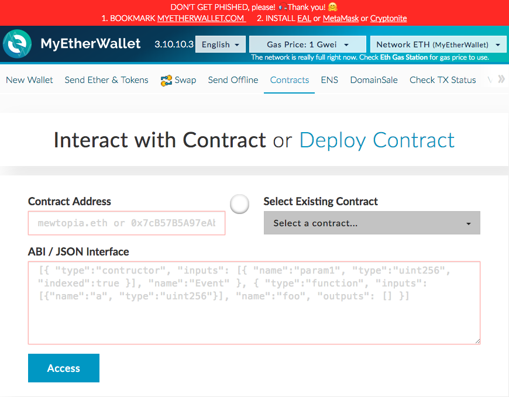

# Основы работы со смарт-контрактом

## Взаимодействие со смарт-контрактом
Взаимодействие со смарт-контрактом происходит посредством вызова функций контракта с указанием параметров.
Для взаимодействия необходимо знать адрес смарт-контракта.
На основе адреса нужно получить ABI-интерфейс.
По ABI интерфейсу можно вызвать целевую функцию.

## Получение ABI интерфейса
Для получения интерфейса вам необходимо:
* Открыть https://etherscan.io

* В правом верхнем углу в окне с надписью «search by address» ввести адрес целевого смарт-контракта и нажать «go»

* Нажать на вкладку «Code»:
  

Скриншот

  

  

* Найти поле с надписью «Contract ABI» и нажать на кнопку «Copy» справа от надписи
  

Скриншот

  

  

* Интерфейс ABI контракта теперь скопирован в буфер обмена.

## Вызов функции
* Откройте кошелек https://www.myetherwallet.com

* Выберите вкладку «контракты» и заполните поля «Адрес контракта» и «ABI/JSON интерфейс» (его мы получили в предыдущей части инструкции). Нажмите на кнопку «подключиться».
  

Скриншот

  

  

* После этого нам станет доступен список функций контракта. Выберите целевую функцию и заполните параметры.
  

Скриншот

  

  

* После выбора функции и заполнения параметров получите доступ к кошельку-владельцу смарт-контракта удобным вам способом и нажмите на кнопку «записать».
  

Скриншот

  

  

* Далее нажмите на кнопку «Да, я уверен, выполнить транзакцию».
  

Скриншот

  

  

>Внимание! Перед тем как нажать «записать» внимательно проверьте введенные данные. Часто формат данных отличается от привычного пользователю вида.

* После этого внизу появится зеленая панель со ссылкой «Verify transaction». Нажмите на эту ссылку, чтобы открыть страницу с информацией о транзакции в Etherscan. Ждите окончания выполнения транзакции.

## Как воспользоваться функцией ручного выпуска токенов
В каждом из контрактов распродажи (PreITO и ITO) доступны две функции для ручного выпуска токенов:

* mintTokensExternal(to, tokens) - данная функция предназначена для непосредственного выпуска токенов.  
  

Скриншот

  

  

Принимает два параметра:  
  * «to» - адрес кошелька инвестора, на чей счет выпускаются токены
  * «tokens» - количество токенов, которое нужно выпустить

>Внимание! Для того, чтобы выпустить 1 токен, мы должны указать «1 000 000 000 000 000 000» в поле «tokens» (18 нулей, без пробелов).

* mintTokensByETHExternal(to, invested) - данная функция предназначена для выпуска токенов с автоматическим расчетом количества, в зависимости от даты и времени выполнения транзакции и суммы эфира, указанной в поле «invested».
  

Скриншот

  

  

Принимает два параметра:  
  * «to» - адрес кошелька инвестора, на чей счет выпускаются токены
  * «invested» - количество эфира, на основании которого будет производиться автоматический расчет (начисляться бонус, в зависимости от даты и времени выполнения транзакции)

>Внимание! Сумма «invested» указывается не в ETH, а в Wei. Это в 18 раз меньше, чем ETH.  
Для того, чтобы выпустить токены на сумму в 1 ETH, мы должны в поле «invested» указать «1 000 000 000 000 000 000» (18 нулей, без пробелов).

Вызывать данные функции может только владелец смарт-контракта.

## Как посмотреть интерфейс смарт-контракта
* Открыть https://etherscan.io
* В правом верхнем углу в окне с надписью «search by address» ввести адрес целевого смарт-контракта и нажать «go»
* В открывшейся странице нажать на вкладку «Read Contract»
  

Скриншот

  

  

## Памятка владельцу смарт-контрактов
Владелец смарт-контрактов должен после каждой распродажи вызвать функцию finish() у соответствующего смарт-контракта распродажи. А именно:
* По окончанию распродажи у контракта PreITO вызвать finish()  
адрес контракта: 0xa8aa8ca08fb065c5b619db05c92d91b05688744c
* По окончанию распродажи у контракта ITO вызвать finish()  
адрес контракта: 0x920601d7ad2256de7a18a2ed67627ba590b1b2a5
* Перед вызовом убедитесь, что адрес контракта соответствует текущей распродаже!
