# Руководство для инвестора

## Какие кошельки можно использовать для покупки токенов
Токены можно купить с помощью кошельков, которые поддерживают стандарт ERC20.
Самые распростаненные кошельки:
* MyEtherWallet
* Ethereum Wallet / Mist
* Parity

Не покупайте токены напрямую с бирж или обменников!

## Создание кошелька
Для участия в распродаже вам необходим кошелек эфира с поддержкой ERC20.
Если у вас такого нет, рукомендуется использовать https://www.myetherwallet.com.

1. Перейдите по ссылке https://www.myetherwallet.com
  

Screenshot

  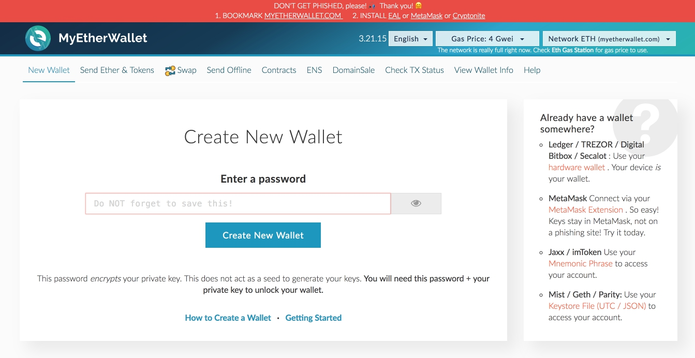

  
 

2. Введите надежный, но легко запоминаемый пароль. Не забудьте его. Нажмите "Create New Wallet/Создать кошелек"
  

Screenshot

  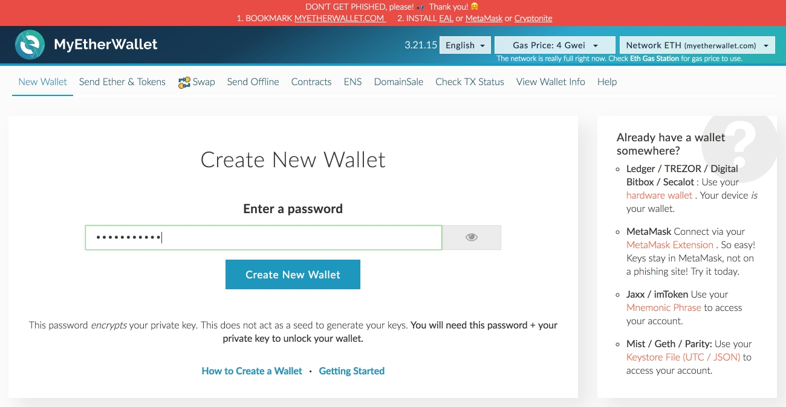

  
 

3. Скачайте Keystore файл кошелька и сохраните этот файл, нажав на синюю кнопку.  
Прочтите предупреждение. Если вам оно понятно, нажмите кнопку "I understand. Continue".
  

Screenshot

  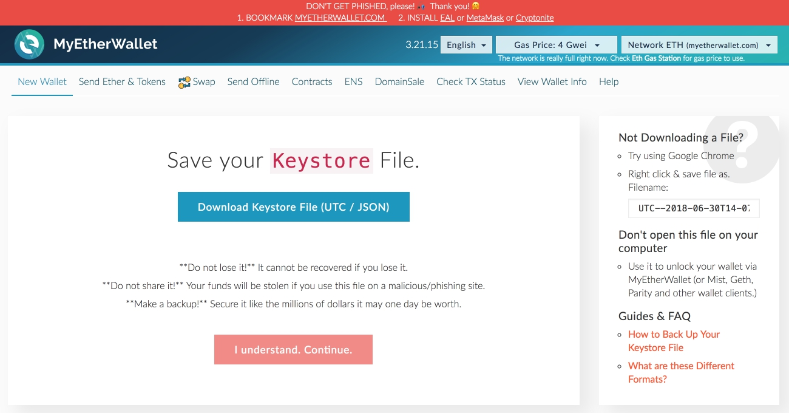

  
 

4. Распечатайте приватный ключ от кошелька на принтере и/или внимательно перепешите его вручную. Скопируйте и сохраниете адрес вашего кошелька в текстовом документе.
  

Screenshot

  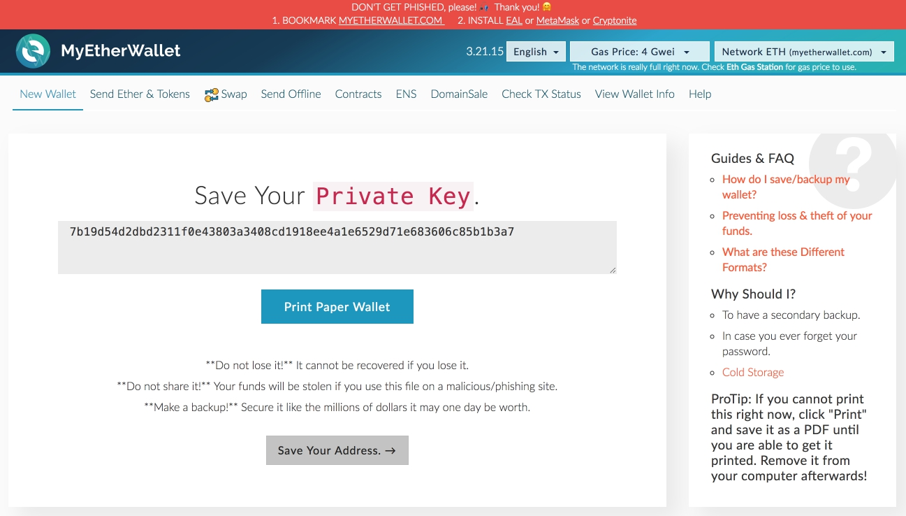

  
 

5. Чтобы увидеть информацию о вашем кошельке, нажмите "View Wallet Info/ Информация о кошельке".
  

Screenshot

  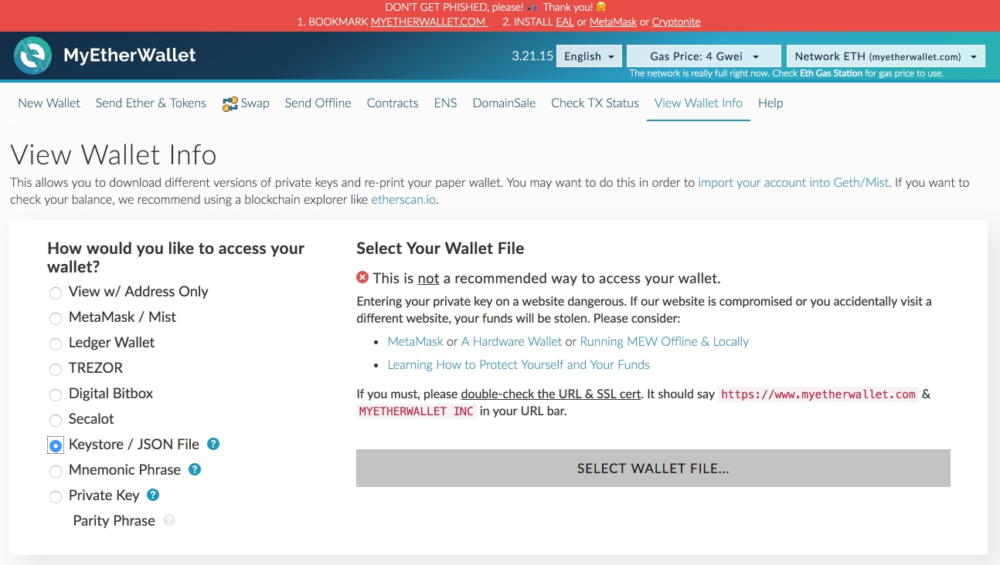

  
 

6. Нажмите "Select wallet file/ Выбрать файл с кошельком", выберете сохраненный ранее Keystore файл, введите пароль. Затем нажмите "Unlock/ Отпереть".
  

Screenshot

  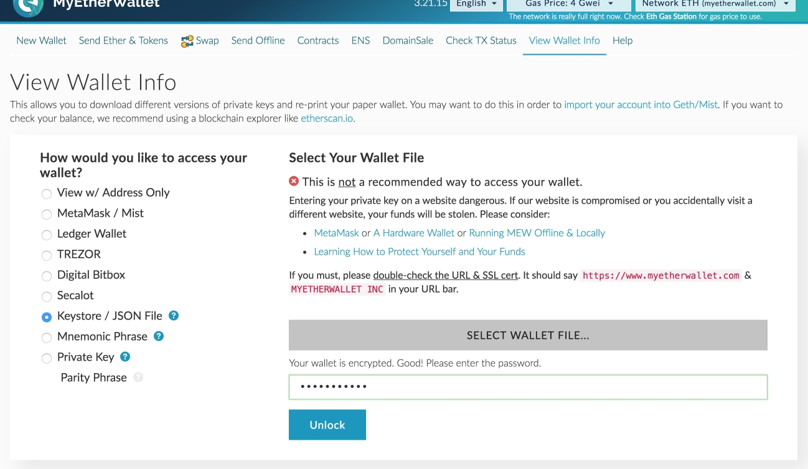

  
 

7. Адрес вашего кошелька будет указан в поле "Your address/ Ваш адрес"
  

Screenshot

  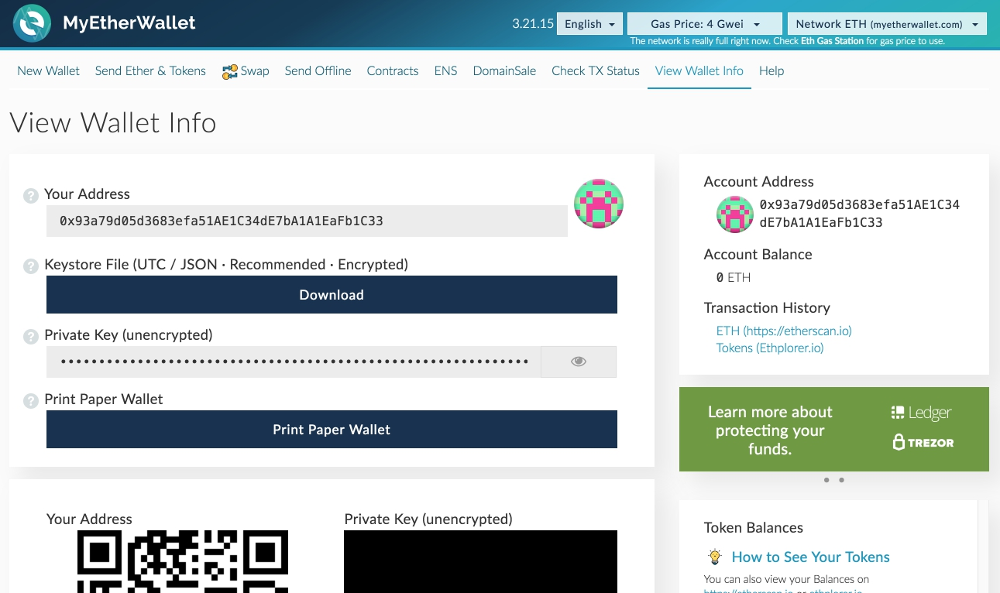

  
 

## Покупка ethereum
Для участия в распродаже вам нужно иметь Ether (ETH).
Вы можете купить ETH, используя карты Visa или MasterCard в следующих сервисах:
* Changelly: https://changelly.com
* Cex.io: https://cex.io
* Coinbase https://www.coinbase.com

Для покупки вам понадобится адрес кошелька, создание которого описано выше.
Все сервисы имеют различные комиссии и курсы.
Убедитесь, что выбранный курс обмена вас устраивает.

## Покупка токенов
Чтобы купить токены, вам нужно отправить не менее 0.1 ETH на адрес контракта текущей распродажи:
PreITO - 0xa8Aa8cA08Fb065C5b619DB05c92d91b05688744C
ITO - 0x920601D7aD2256De7a18A2eD67627bA590B1b2A5
Перед отправкоц убедитесь:
1. Вы отправляете не менее 0.1 ETH (в зависимости от конфигурации контракта, значение может быть другим. Смотрите minInvestedLimit соответствующего контракта).
2. Количество газа не менее 250 000.
3. Цена газа не менее 30 Gwei. Транзакции с меньшим количеством газа будут выполняться дольше.

Если вы используете MyEtherWallet, сделайте следующее:
1. Перейдите по ссылке https://www.myetherwallet.com

2. Нажмите "Send Ether & Tokens/ Перевести эфир и токены"
  

Screenshot

  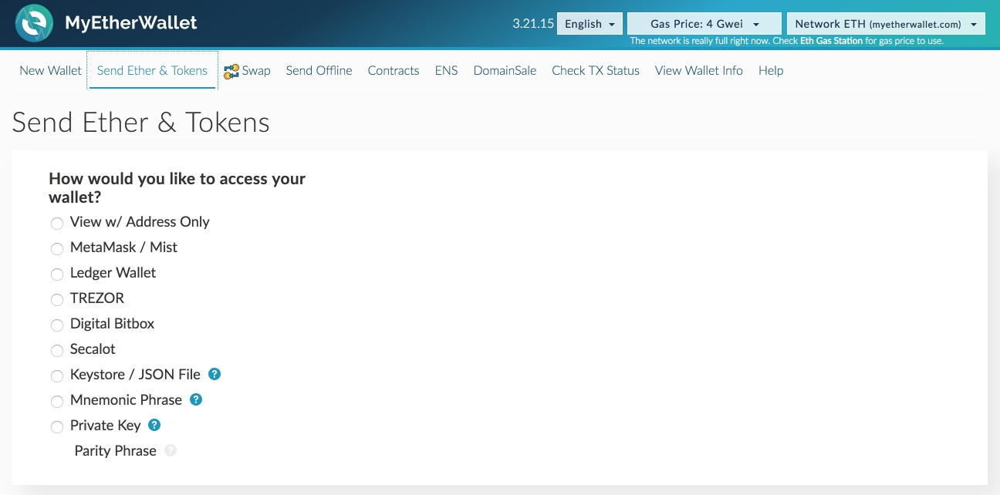

  
 

3. Выберите "Keystore / JSON File". Нажмите "Select wallet file/ Выбрать файл с кошельком", введите пароль и нажмите "Unlock/ Отпереть".
  

Screenshot

  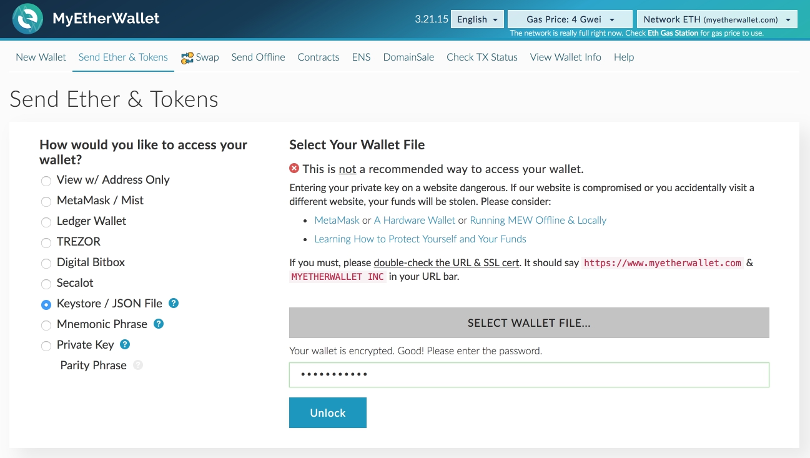

  
 

4. В поле адреса введите 0xa8Aa8cA08Fb065C5b619DB05c92d91b05688744C (во время PreITO) или 0x920601D7aD2256De7a18A2eD67627bA590B1b2A5 (во время ITO).  
Введите сумму эфира, на которую вы хотите купить токены.
  

Screenshot

  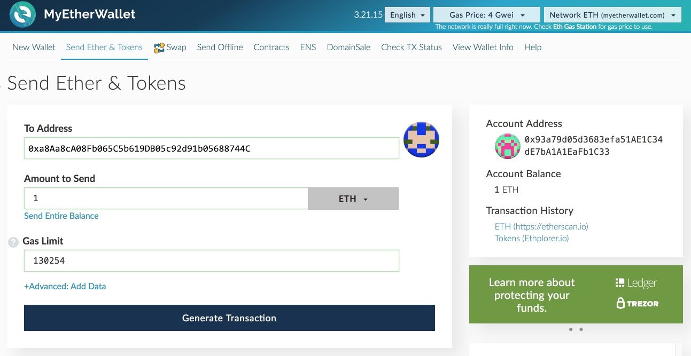

  
 

5. Нажмите "Generate transaction/ Сформировать транзакцию", затем "Send transaction/ Отправить транзакцию".
  

Screenshot

  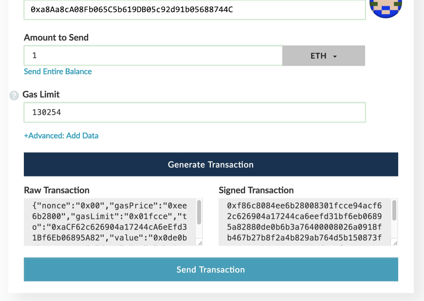

  
 

6. В появившемся окне нажмите "Yes, I am sure! Send transaction/ Да, я уверен! Отправить транзакцию".
  

Screenshot

  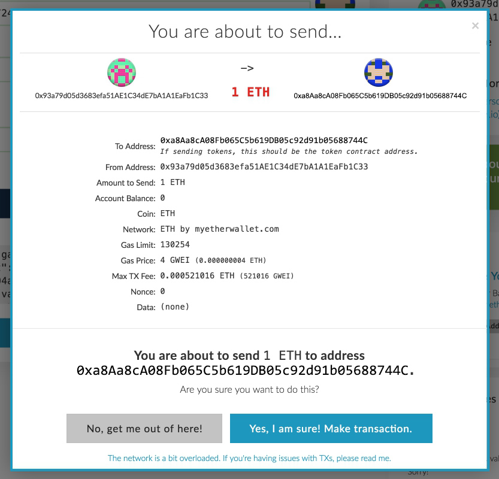

  
 

## Управление токенами
Чтобы добавить токены в ваш кошелек, вам необходима следующая информация:
* Адрес контракта токена - 0x34c0768c77fbeea5fb7a7b6f2c20dcfa504faadf
* Символ токена — AMT
* Дробность — 18

Если вы используете MyEtherWallet, сделайте следующее:
1. Перейдите по ссылке https://www.myetherwallet.com
2. Нажмите "View Wallet Info/ Информация о кошельке"
  

Screenshot

  

  
 

3. Выберете пункт "Keystore / JSON File", нажмите "Select wallet file/ Выбрать файл с кошельком", введите пароль и нажмите "Unlock/ Отпереть".
  

Screenshot

  

  
 

4. В правой части вы увидете панель "Token Balances/ Балансы токенов". Нажмите "Add custom token/ Добавить свой токен".
  

Screenshot

  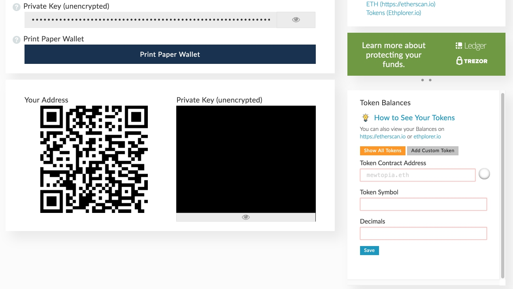

  
 

5. Введите информацию о токене и нажмите "Save/ Сохранить".
  

Screenshot

  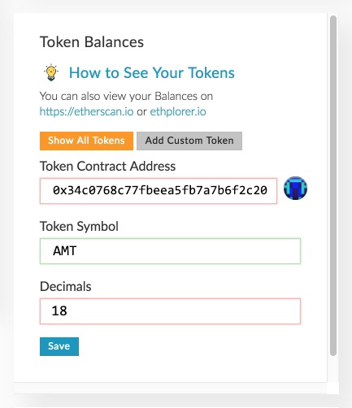

  
 
